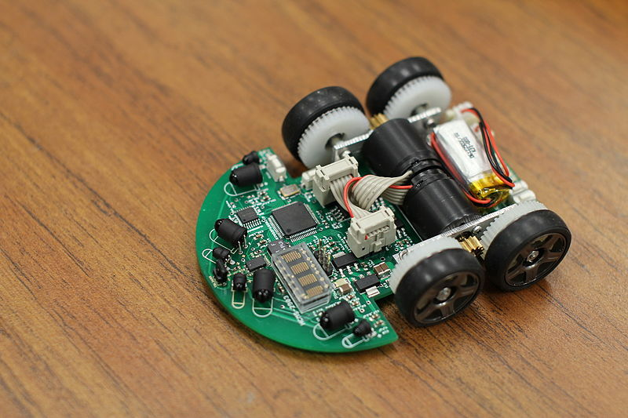
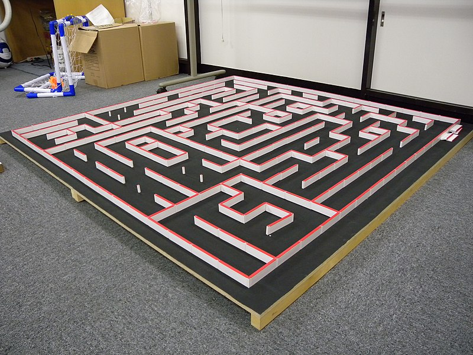
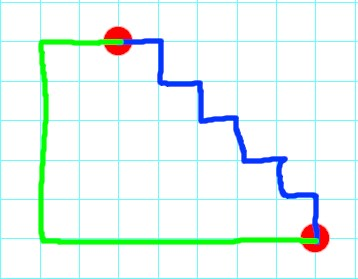

<!-- _class: lead -->
# マイクロマウス 迷路探索
**美添 健**
システム制御系 B3


---
<!-- _header: 目次 -->
1. マイクロマウスとは
1. 問題設定
1. 迷路や経路などの設計
1. 幅優先探索
1. 深さ優先探索
1. 回転/加減速コストの導入
1. コスト付き探索(dijkstra法)
1. A*探索
1. 評価


---
<!-- _header: マイクロマウスとは -->
マイクロマウスは手のひらサイズのロボットを使って16×16サイズの迷路の外周部分に設けられたスタート地点から中央部のゴール地点にたどり着くことを⽬指すロボット競技。

 

---
<!-- _header: 問題設定 -->
本来は
- 迷路の情報は事前に与えられない
- 5回の走行を行って最も速くゴールに到達できたタイムを得点とする

というルールから1回目の走行で迷路の情報を取得して2回目の走行から最短経路を探索&走行という手順で行われるが...

ここでは2回目以降の迷路が完全に既知の状態で最も速く迷路を走行できるルートを探索できる問題を解く。

(1回目の走行での迷路情報の取得については足立法という有名な方法が広く用いられているらしいです。)

---
<!-- _header: 迷路や経路などの設計 -->
## 迷路
理科大のサークル、Mice(http://mice.deca.jp/maze/)が配布しているデータを読み込めるように[16][16]サイズのuint8配列を用意して、各ビットが壁の有無を表すように表現した壁の情報を表現。
壁の情報・スタート地点の座標・ゴール地点の座標をメンバ変数として持つクラスを迷路と定義。
## 経路
ロボットが進む方向(8方向)を表す列挙型を定義し、その列挙型の可変長配列と既にロボットが通った場所の情報の組を持つstructを経路と定義。

---
<!-- _header: 幅優先探索 -->
「先入れ先出し」のコンテナである`queue`を使って実装
```cpp
// キューを作ってスタート地点を追加
std::queue<Path> open;
Path start(maze.GetStart());
open.push(start);
while (true) {
  // キューが空ならば終了(探索失敗)
  if (open.empty()) {
    return Path(maze.GetStart());
  }
  // キューから一つ経路を取り出す
  Path n = open.top();
  open.pop();
  // 経路の最終地点がゴールと一致していたら終了(探索成功)
  if (n.GetPosition().x == maze.GetGoal().x &&
      n.GetPosition().y == maze.GetGoal().y) {
    return n;
  }
  // 次に進める経路を取得してキューに追加する
  auto next_paths = n.GetNextPaths(maze);
  for (int i = 0; i < next_paths.size(); i++) {
    open.push(next_paths.at(i));
  }
}
```
---
<!-- _header: 深さ優先探索 -->
「後入れ先出しの」コンテナである`stack`を使って実装
```cpp
// スタックを作ってスタート地点を追加
std::stack<Path> open;
Path start(maze.GetStart());
open.push(start);
while (true) {
  // スタックが空ならば終了(探索失敗)
  if (open.empty()) {
    return Path(maze.GetStart());
  }
  // スタックから一つ経路を取り出す
  Path n = open.top();
  open.pop();
  // 経路の最終地点がゴールと一致していたら終了(探索成功)
  if (n.GetPosition().x == maze.GetGoal().x &&
      n.GetPosition().y == maze.GetGoal().y) {
    return n;
  }
  // 次に進める経路を取得してスタックに追加する
  auto next_paths = n.GetNextPaths(maze);
  for (int i = 0; i < next_paths.size(); i++) {
    open.push(next_paths.at(i));
  }
}
```

---
<!-- _header: 幅優先探索/深さ優先探索の探索結果 -->

(最後に探索中の様子を見せます)

---
<!-- _header: 回転/加減速コストの導入 -->
コストを単純に移動回数とすると、幅優先探索で最短経路が求まるが...

ロボットは旋回するときに旋回する時間+加減速の時間があることを考えると、多少遠回りになったとしても直線的な経路を走ったほうが速い。


青のほうが短い経路だが、多分緑の経路のほうが早い。

---
<!-- _header: 回転/加減速コストの導入 -->
そこで

- 移動コストとして必ず1。
- 旋回する時間は現在の方向から次の方向までの角度の差/45deg。
- 加減速する時間は1マス以内に最高速度まで加速できていると仮定して、旋回する際に一定のコスト(3)を付加。

というように問題を再度モデリング。

---
<!-- _header: コスト付き探索(dijkstra法) -->
優先度付きキュー`priority_queue`を使って実装。
```cpp
// 優先度付きキューを作ってスタート地点を追加
auto compare = [](const Node& lhs, const Node& rhs) {
  return lhs.cumulative_cost > rhs.cumulative_cost;
};
std::priority_queue<Node, std::vector<Node>, decltype(compare)> open{compare};
Path start(maze.GetStart());
open.push({start, 0});
while (true) {
  /* --- 深さ優先探索/幅優先探索と同じなので略 --- */
  // 次の経路を取得・累積コストを計算して優先度付きキューに追加
  auto next_paths = n.path.GetNextPaths(maze);
  for (int i = 0; i < next_paths.size(); i++) {
    if (n.path.GetDirections().size() == 0) {
      open.push({next_paths.at(i), n.cumulative_cost + 1});
      continue;
    }
    int rotate_cost =
        std::abs((DirectionToInt(n.path.GetDirections().back()) -
                  DirectionToInt(next_paths.at(i).GetDirections().back()))) %
        4;
    int acc_cost = rotate_cost == 0 ? 0 : 3;
    open.push(
        {next_paths.at(i), n.cumulative_cost + 1 + rotate_cost + acc_cost});
  }
}
```

---

<!-- _header: A*探索 -->
ヒューリスティック関数をゴールまでのマンハッタン距離として実装。

---
<!-- _header: Dijkstra法/A*探索の探索結果 -->

(最後に探索中の様子を見せます)

---
<!-- _header: 評価 -->
以下の4つの評価軸で評価

- コスト①：移動回数
- コスト②：回転と加減速を考慮したコスト
- 計算量：ループ回数
- 計算時間：計算にかかった時間[ms]
- メモリ量：実行時のコンテナの最大サイズ

---
<!-- _header: 評価 -->
|アルゴリズム|コスト①|コスト②|計算量|計算時間[ms]|メモリ量|
|---|---|---|---|---|---|
|幅優先探索|55|69|73921|226|17594|
|深さ優先探索|64|62|1836|5|32|
|dijkstra|57|45|31477|196|7585|
|A*|57|45|22441|151|5482|

---
<!-- _header: 実演 -->
最後に実際に実行して探索している様子をお見せします。

また、コードはGitHub上で公開しています。
https://github.com/kenyoshizoe/maze-solver
